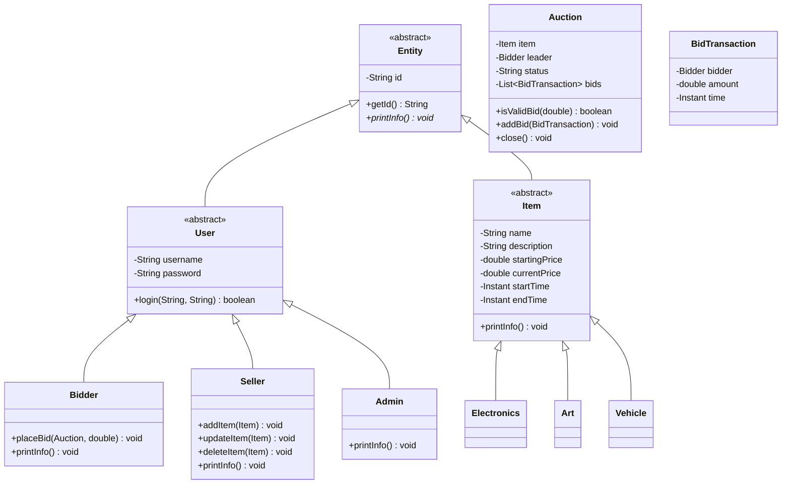

```mermaid
classDiagram
    class Entity {
        <<abstract>>
        -String id
        +getId() String
        +printInfo()* void
    }

    class User {
        <<abstract>>
        -String username
        -String password
        +login(String, String) boolean
    }
    class Bidder {
        +placeBid(Auction, double) void
        +printInfo() void
    }
    class Seller {
        +addItem(Item) void
        +updateItem(Item) void
        +deleteItem(Item) void
        +printInfo() void
    }
    class Admin {
        +printInfo() void
    }

    class Item {
        <<abstract>>
        -String name
        -String description
        -double startingPrice
        -double currentPrice
        -Instant startTime
        -Instant endTime
        +printInfo() void
    }
    class Electronics
    class Art
    class Vehicle

    class Auction {
        -Item item
        -Bidder leader
        -String status
        -List~BidTransaction~ bids
        +isValidBid(double) boolean
        +addBid(BidTransaction) void
        +close() void
    }
    class BidTransaction {
        -Bidder bidder
        -double amount
        -Instant time
    }

    Entity <|-- User
    User <|-- Bidder
    User <|-- Seller
    User <|-- Admin

    Entity <|-- Item
    Item <|-- Electronics
    Item <|-- Art
    Item <|-- Vehicle
```