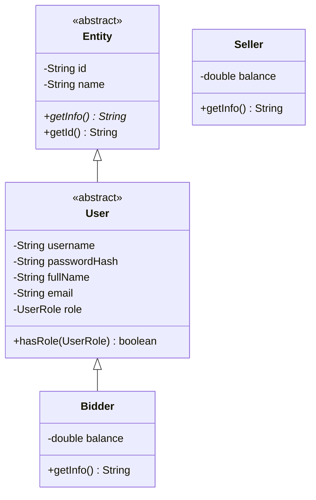

```mermaid
classDiagram
    class Entity{
        <<abstract>>
        -String id
        -String name
        +getInfo()* String
        +getId() String
    }
    class User {
        <<abstract>>
        -String username
        -String passwordHash
        -String fullName
        -String email
        -UserRole role
        +hasRole(UserRole) boolean
    }
    class Bidder{
        -double balance
        +getInfo() String
    }
    class Seller{
        -double balance
        +getInfo() String
    }
Entity<|--User
User<|--Bidder
```
